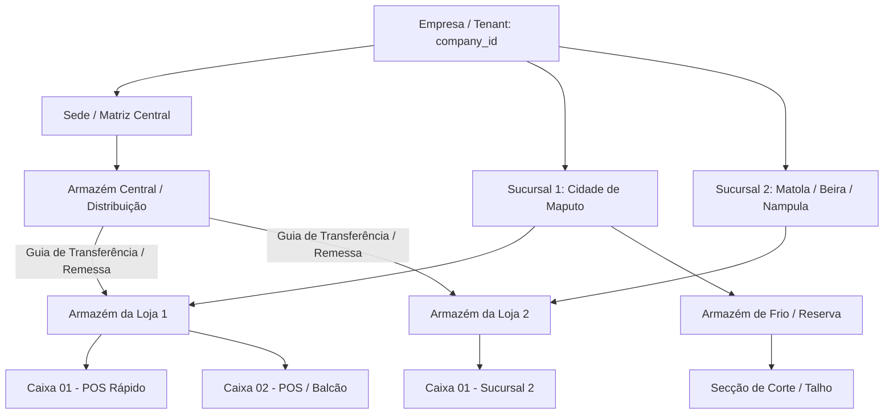
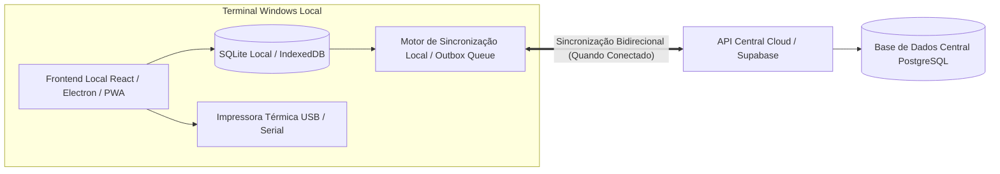

# PLATAFORMA ERP/POS MULTIEMPRESA & MULTI-FILIAL
## Documento Estratégico, Arquitetura Técnica, Modelo de Licenciamento & Blueprint para Transformação SaaS

> **Data:** Agosto de 2026  
> **Mercado Alvo:** Moçambique e África Austral  
> **Cliente Piloto / Referência Inicial:** Casa de Pneus  
> **Princípio Central:** 1 Plataforma Única • Múltiplos Tenants (Empresas) • Dados 100% Isolados • Licenciamento Modular • Offline-First (Windows) • Multi-Sucursal & Multi-Armazém • Adaptável a Supermercados, Talhos, Lojas de Peças, Retalho e Grossistas.

---

## 1. Marca Comercial Seleccionada

### **Movax ERP / POS**

- **Marca da plataforma:** Movax ERP
- **Produto de balcão:** Movax POS
- **Slogan:** **Gestão que move o seu negócio.**
- **Ideia da marca:** movimento + avanço; uma plataforma que ajuda a empresa a vender, controlar e crescer sem complicação.
- **Posicionamento:** ERP/POS profissional, simples de operar, preparado para empresas moçambicanas de retalho, distribuição, serviços, supermercados, talhos, oficinas e lojas de peças.
- **Regra de neutralidade:** Casa de Pneus é apenas o tenant/cliente piloto; nenhum dado comercial ou fiscal desse cliente pode definir a identidade da plataforma.

---

## 2. Visão Geral e Princípio do Produto

O sistema existente (construído originalmente com React, TypeScript, Tailwind/CSS e Supabase/PostgreSQL) já cobre vendas, faturação, catálogo de produtos, stock, movimentos, clientes, fornecedores, contas correntes, relatórios e utilizadores.

A transformação SaaS visa:
- **Tenant Isolation (Multiempresa):** Nenhuma empresa vê os dados de outra. Cada registo na base de dados possui `company_id`.
- **Neutralidade de Marca:** Logótipo, Nome da Empresa, NUIT, Endereço, Bancos, NIBs, Moeda e Séries Fiscais são carregados dinamicamente com base na empresa ativa.
- **Licenciamento vs Permissões:**
  - **Licença (Subscrição / Add-ons):** O que a **empresa** comprou da plataforma (Ex: Módulo de Talho, Multi-Armazém, BI Pro).
  - **Permissão (RBAC):** O que o **utilizador** pode fazer dentro dos módulos que a empresa contratou (Ex: Operador de Caixa só fatura; Gerente faz ajustes de stock).
- **Simplicidade Extrema & Transição Suave:** Interface pensada para operadores habituados a sistemas legados (Primavera, PHC, Sage, Excel ou faturas manuais). Suporte total a atalhos de teclado (F1-F12, Enter rápido), leitor de código de barras e ecrã táctil.

---

## 3. Arquitetura Multi-Sucursal e Multi-Armazém (Lógica de Mercado Real)

A plataforma suporta estruturas empresariais complexas e operacionais do dia-a-dia moçambicano:



### Regras de Negócio de Armazéns e Sucursais:
1. **Ligação Flexível Sucursal-Armazém:**
   - Uma **Sucursal** (Loja/Filial) pode ter **1 ou mais Armazéns** (ex: Armazém de Balcão, Armazém Traseiro, Câmara Frigorífica).
   - Um **Armazém Central** pode pertencer à Sede e abastecer todas as sucursais.
2. **Lógica de Caixas / Terminais POS:**
   - Cada Caixa/Terminal é associado a uma **Sucursal** e consome stock de um **Armazém predefinido** (armazém de venda da loja).
   - Suporte a múltiplas caixas a operar em simultâneo na mesma loja sem conflito de números de documentos.
3. **Transferências de Stock em 2 Etapas (Prevenção de Furtos e Erros):**
   - **Etapa 1 (Saída/Em Trânsito):** O armazém de origem emite uma *Guia de Transferência*; o stock sai da origem e fica classificado como "Em Trânsito".
   - **Etapa 2 (Recepção/Confirmação):** O encarregado da sucursal de destino confere as quantidades físicas recebidas e confirma a entrada. Diferenças geram auto de quebra/sobra para auditoria.
4. **Visibilidade de Stock Global com Controlo de Acesso:**
   - O vendedor de uma loja pode consultar em tempo real se outra loja do grupo tem o artigo em stock para orientar o cliente.

---

## 4. Adaptação Vertical: Supermercados, Talhos, Retalho e Serviços

A plataforma possui modos de operação configuráveis por empresa/loja:

### A. Modo Supermercado (Caixas Rápidas e Alto Volume)
- **Interface de Caixa Rápida:** Focada 100% no leitor de código de barras sem necessidade de tocar no rato.
- **Suporte a Balanças com Código de Barras (EAN-13 Embutido):**
  - Leitura de etiquetas de peso/preço geradas por balanças (padrão de supermercado `20XXXXXWWWWWC` ou `20XXXXXPPPPPC`).
  - Identifica automaticamente o produto e o peso líquido (kg) ou valor total.
- **Gestão de Fecho de Caixa Cego:**
  - O operador não vê quanto o sistema calculou que deveria estar na gaveta. No fecho do turno, insere o dinheiro físico contado (MZN, USD, ZAR, M-Pesa, Cartão POS). O gerente visualiza o relatório de quebras/sobras de caixa.
- **Operações de Caixa:** Sangrias (retiradas de segurança), Reforços/Fundos de Maneio, Cancelamento de item com autorização de supervisor via PIN/Cartão.

### B. Modo Talho / Carnes (Gestão de Pesos, Desmancho e Rendimento)
- **Conversão de Carcaça em Cortes (Desmancho / Transformação de Stock):**
  - Entrada de Carcaça de Bovino (ex: 200 kg) e transformação em peças: Picanha (3 kg), Lombo (6 kg), Carne Picada (30 kg), Ossos/Gordura (Quebra).
  - Cálculo automático do custo médio ponderado por corte e controlo de perda/quebra por desidratação.
- **Lotes e Datas de Validade:** Rastreamento rigoroso de lote e expiração de produtos perecíveis com alerta antecipado.

### C. Modo Casa de Pneus / Oficina / Auto Peças / Hardware
- Gestão de Medidas, Marcas, DOTs, Aplicação por Veículo, Serviços associados (Alinhamento, Calibragem, Montagem) integrados na mesma fatura com controlo de serviços vs artigos com efeito de stock.

---

## 5. Funcionamento Offline-First no Windows & Sincronização Bidirecional com a Nuvem

Para o mercado de Moçambique, onde a internet móvel/fibra pode sofrer instabilidades, o sistema possui **arquitetura híbrida offline-first**:



### Mecanismo de Funcionamento Offline:
1. **Séries de Faturação e Numeração Local Isolada:**
   - Para evitar duplicação de números de fatura enquanto vários caixas operam offline, cada terminal POS possui uma série dedicada ou prefixo:
     - Exemplo: `FR LOJA01-CX01/2026/000142` e `FR LOJA01-CX02/2026/000089`.
   - As faturas emitidas offline são documentos fiscais legais e válidos impressos na hora na impressora térmica do balcão.
2. **Outbox Pattern & Fila de Eventos:**
   - Toda a venda, movimento de stock ou pagamento offline é gravado na base de dados local com `sync_status = 'pending'` e um `idempotency_key` (UUIDv4).
3. **Sincronização Automática em Background:**
   - Um worker monitoriza a conectividade. Quando a internet regressa:
     - **Push (Upload):** Envia as vendas e movimentos locais para a nuvem em lotes compactados.
     - **Pull (Download):** Atualiza a base de dados local com novos produtos, preços atualizados pela sede, e novas regras promocionais.
4. **Resolução de Conflitos:**
   - **Vendas e Movimentos:** Modelo *Append-Only* (não há conflito, a nuvem aceita os registos pelo timestamp do cliente).
   - **Catálogo de Artigos e Preços:** A Sede (Cloud) é a autoridade máxima (*Server Authority*).
   - **Stock Central:** O servidor recalcula os saldos consolidados assim que os movimentos locais chegam.

---

## 6. Segmentação de Módulos, Preços em Meticais (MZN) e Bundles

### 6.1 Catálogo de Módulos & Add-ons
| Módulo / Add-on | Descrição & Valor Entregue | Preço Mensal Indicativo | Estado |
| :--- | :--- | :--- | :--- |
| **CORE (Licença Base)** | Autenticação, 1 Empresa, 1 Sucursal, 1 Armazém, POS Vendas, Faturas/Recibos/Proformas, Catálogo, Clientes/Fornecedores, Stock Básico e Fecho de Caixa. | **4.500 MZN/mês** | Concluído / Ajustar |
| **Stock Avançado** | Múltiplos armazéns, transferências em trânsito, histórico detalhado, ficha de produto com lote/validade, inventários físicos e alertas de ruptura. | **1.500 MZN/mês** | Concluído / Evoluir |
| **Compras & Fornecedores** | Faturas de fornecedores, cálculo automático de custo médio/preço de venda com margem e IVA, contas correntes de fornecedores. | **1.500 MZN/mês** | Concluído / Evoluir |
| **Financeiro & Contas Correntes** | Extratos de conta de clientes, liquidações totais/parciais, recibos de liquidação, controlo de pagamentos a prazo e avisos de cobrança. | **2.000 MZN/mês** | Concluído / Evoluir |
| **Relatórios & BI Pro** | Análise de margem de lucro real por produto/categoria, mapa de IVA, curva ABC de vendas, curva de rentabilidade e exportações Excel/PDF. | **1.500 MZN/mês** | Concluído / Evoluir |
| **Multi-Filial / Sucursais** | Gestão de múltiplas lojas com consolidação central, preços diferenciados por região e relatórios comparativos. | **1.500 MZN/filial/mês** | Próxima Etapa |
| **Módulo Supermercado & Balanças** | Leitura de código de barras de balança, frente de caixa ultra-rápida, caixas múltiplos e fecho cego de operador. | **1.500 MZN/mês** | Próxima Etapa |
| **Módulo Talho & Desmancho** | Ficha técnica de desmancho de carcaças, cálculo de quebra/rendimento de carnes, rastreio de lote e peso líquido. | **1.500 MZN/mês** | Próxima Etapa |
| **Offline-First & Sincronização Local** | Motor local Windows para operação ininterrupta sem internet com sync cloud automático. | **1.500 MZN/loja/mês** | Roadmap |
| **Pagamentos Locais (M-Pesa / e-Mola)** | Integração direta via API/QR Code para liquidação imediata na caixa registadora com reconciliação automática. | **1.500 MZN/mês + taxas** | Roadmap |
| **Segurança & Auditoria Pro** | Perfis de utilizador detalhados por função (RBAC fino), logs de todas as ações sensíveis (anulações, descontos, consultas de custo). | **1.000 MZN/mês** | Concluído / Evoluir |

### 6.2 Planos Comerciais Recomendados (Bundles)
- **STARTER (4.500 MZN/mês):** 1 Loja, 1 Armazém, 3 Utilizadores. Core completo para pequenas lojas e prestadores de serviços.
- **BUSINESS (8.900 MZN/mês):** 1 Loja, 2 Armazéns, 7 Utilizadores. Core + Stock Avançado + Compras + Financeiro (Plano ideal para lojas de peças, supermercados de bairro, lojas comerciais).
- **PRO (13.900 MZN/mês):** 2 Sucursais, Múltiplos Armazéns, 15 Utilizadores. Business + BI Pro + Segurança Pro + Multi-Filial base.
- **ENTERPRISE (Sob Proposta):** Redes de supermercados, grandes distribuidores, talhos industriais, armazéns centrais, API aberta, SLA prioritário e suporte presencial.

---

## 7. Modelo de Dados PostgreSQL / Supabase Multi-Tenant

A arquitetura de base de dados para garantir isolamento e flexibilidade multi-sucursal é estruturada da seguinte forma:

```sql
-- 1. Tenants / Empresas
CREATE TABLE public.companies (
    id UUID PRIMARY KEY DEFAULT gen_random_uuid(),
    code VARCHAR(50) UNIQUE NOT NULL, -- Ex: 'casadepneus', 'supermercado-vip'
    name VARCHAR(255) NOT NULL,
    trade_name VARCHAR(255),
    nuit VARCHAR(50) NOT NULL,
    email VARCHAR(255),
    phone VARCHAR(50),
    address TEXT,
    city VARCHAR(100),
    logo_url TEXT,
    currency VARCHAR(10) DEFAULT 'MZN',
    tax_standard_rate NUMERIC(5,2) DEFAULT 16.00,
    status VARCHAR(20) DEFAULT 'ACTIVE', -- 'TRIAL', 'ACTIVE', 'SUSPENDED', 'CANCELLED'
    created_at TIMESTAMPTZ DEFAULT now(),
    updated_at TIMESTAMPTZ DEFAULT now()
);

-- 2. Sucursais / Filiais
CREATE TABLE public.branches (
    id UUID PRIMARY KEY DEFAULT gen_random_uuid(),
    company_id UUID NOT NULL REFERENCES public.companies(id) ON DELETE CASCADE,
    code VARCHAR(50) NOT NULL, -- Ex: 'MAPUTO-SEDE', 'MATOLA-LOJA'
    name VARCHAR(255) NOT NULL,
    address TEXT,
    phone VARCHAR(50),
    is_main BOOLEAN DEFAULT false,
    is_active BOOLEAN DEFAULT true,
    created_at TIMESTAMPTZ DEFAULT now(),
    UNIQUE(company_id, code)
);

-- 3. Armazéns (Ligados a Sucursal ou Centrais)
CREATE TABLE public.warehouses (
    id UUID PRIMARY KEY DEFAULT gen_random_uuid(),
    company_id UUID NOT NULL REFERENCES public.companies(id) ON DELETE CASCADE,
    branch_id UUID REFERENCES public.branches(id) ON DELETE SET NULL,
    code VARCHAR(50) NOT NULL, -- Ex: 'ARM-CENTRAL', 'ARM-LOJA-01'
    name VARCHAR(255) NOT NULL,
    warehouse_type VARCHAR(50) DEFAULT 'GENERAL', -- 'GENERAL', 'RETAIL', 'COLD_STORAGE', 'TRANSIT'
    is_active BOOLEAN DEFAULT true,
    created_at TIMESTAMPTZ DEFAULT now(),
    UNIQUE(company_id, code)
);

-- 4. Terminais POS / Caixas
CREATE TABLE public.pos_terminals (
    id UUID PRIMARY KEY DEFAULT gen_random_uuid(),
    company_id UUID NOT NULL REFERENCES public.companies(id) ON DELETE CASCADE,
    branch_id UUID NOT NULL REFERENCES public.branches(id) ON DELETE CASCADE,
    default_warehouse_id UUID NOT NULL REFERENCES public.warehouses(id),
    terminal_code VARCHAR(50) NOT NULL, -- Ex: 'POS-01', 'CAIXA-RAPIDO-2'
    invoice_series_prefix VARCHAR(20) NOT NULL, -- Ex: 'FR MPT01'
    current_invoice_sequence INTEGER DEFAULT 1,
    is_active BOOLEAN DEFAULT true,
    created_at TIMESTAMPTZ DEFAULT now(),
    UNIQUE(company_id, branch_id, terminal_code)
);

-- 5. Subscrições, Módulos e Licenças
CREATE TABLE public.subscriptions (
    id UUID PRIMARY KEY DEFAULT gen_random_uuid(),
    company_id UUID NOT NULL REFERENCES public.companies(id) ON DELETE CASCADE,
    plan_tier VARCHAR(50) NOT NULL, -- 'STARTER', 'BUSINESS', 'PRO', 'ENTERPRISE'
    status VARCHAR(20) DEFAULT 'ACTIVE', -- 'TRIAL', 'ACTIVE', 'PAST_DUE', 'SUSPENDED'
    starts_at TIMESTAMPTZ DEFAULT now(),
    expires_at TIMESTAMPTZ,
    max_users INTEGER DEFAULT 3,
    max_branches INTEGER DEFAULT 1,
    max_warehouses INTEGER DEFAULT 1,
    max_pos_terminals INTEGER DEFAULT 1,
    active_addons JSONB DEFAULT '[]'::jsonb, -- ['ADVANCED_STOCK', 'PURCHASES', 'FINANCIAL', 'SUPERMARKET_POS', 'BUTCHER_MODULE', 'OFFLINE_SYNC']
    created_at TIMESTAMPTZ DEFAULT now()
);

-- 6. Saldos de Stock por Armazém (Multi-Warehouse Inventory)
CREATE TABLE public.warehouse_stock (
    id UUID PRIMARY KEY DEFAULT gen_random_uuid(),
    company_id UUID NOT NULL REFERENCES public.companies(id) ON DELETE CASCADE,
    warehouse_id UUID NOT NULL REFERENCES public.warehouses(id) ON DELETE CASCADE,
    product_id UUID NOT NULL REFERENCES public.products(id) ON DELETE CASCADE,
    current_stock NUMERIC(14,3) DEFAULT 0,
    reserved_stock NUMERIC(14,3) DEFAULT 0,
    min_stock NUMERIC(14,3) DEFAULT 0,
    ideal_stock NUMERIC(14,3) DEFAULT 0,
    last_count_date TIMESTAMPTZ,
    updated_at TIMESTAMPTZ DEFAULT now(),
    UNIQUE(warehouse_id, product_id)
);

-- 7. Guias de Transferência entre Armazéns
CREATE TABLE public.stock_transfers (
    id UUID PRIMARY KEY DEFAULT gen_random_uuid(),
    company_id UUID NOT NULL REFERENCES public.companies(id) ON DELETE CASCADE,
    transfer_number VARCHAR(50) NOT NULL,
    from_warehouse_id UUID NOT NULL REFERENCES public.warehouses(id),
    to_warehouse_id UUID NOT NULL REFERENCES public.warehouses(id),
    status VARCHAR(30) DEFAULT 'IN_TRANSIT', -- 'PENDING', 'IN_TRANSIT', 'RECEIVED', 'CANCELLED'
    dispatched_by_user_id UUID REFERENCES auth.users(id),
    dispatched_at TIMESTAMPTZ DEFAULT now(),
    received_by_user_id UUID REFERENCES auth.users(id),
    received_at TIMESTAMPTZ,
    notes TEXT,
    created_at TIMESTAMPTZ DEFAULT now()
);
```

---

## 8. Guia de Implementação e Próximos Passos Técnicos

1. **Neutralização Completa do Código:**
   - Substituir referências hardcoded de "Casa de Pneus" nas views de fatura, cabeçalhos, recibos e relatórios pela store reativa `useCompanyStore` / `currentCompany`.
2. **Feature Flags & Gating:**
   - Criar componente `<FeatureGuard feature="ADVANCED_STOCK">` no frontend e middleware de verificação na API/Supabase RLS.
3. **Empacotamento da Aplicação para Windows Offline:**
   - Uso de Electron ou Tauri com base de dados SQLite local embarcada ou PWA com IndexedDB + Background Sync Service Worker.
4. **Módulo de Caixa Rápido para Supermercado & Talho:**
   - Adicionar parser de código de barras de balança no leitor de código (detecta padrão EAN-13 `20...`).
   - Adicionar ecrã de fecho cego de caixa com relatório de quebra/sobra.

---

## 9. Emuladores Locais (Windows) e Arquitetura de Migração para a Vercel

### 9.1 Emuladores Locais de Base de Dados e Plataforma
Para permitir desenvolvimento ágil, testes sem custo de infraestrutura e execução em ambientes Windows desconectados:
- **Stack de Emulação Local Supabase / PostgreSQL:**
  - O projeto suporta emulação completa através do Supabase CLI local (`npx supabase start`), rodando:
    - Base de dados PostgreSQL local (porta `54322`)
    - PostgREST API (porta `54321`)
    - Auth & JWT Service local (porta `54321`)
    - Supabase Studio Dashboard (`http://127.0.0.1:54323`) para inspeção visual de tabelas e RLS.
  - Para terminais POS sem Docker: Camada de persistência local SQLite/IndexedDB para buffer de faturas offline e transações de caixa.
- **Emulador do Frontend / Plataforma:**
  - Servidor Vite de desenvolvimento local com hot-reload imediato (`npm run dev`).
  - Mock handlers e sincronizador local que simula a conectividade e filas de sincronização (Outbox queue).

### 9.2 Arquitetura de Deploy & Migração para a Vercel (Produção SaaS)
A plataforma foi desenhada para uma migração direta e simplificada para a **Vercel**:
- **Hospedagem Frontend na Vercel:**
  - Build otimizado SPA React/Vite com roteamento dinâmico configurado via [`vercel.json`](file:///c:/Users/IBZ/Downloads/casadepeneus/vercel.json).
  - Distribuição em rede global de borda (Edge Network) da Vercel para carregamento instantâneo em qualquer ponto de Moçambique ou exterior.
- **Variáveis de Ambiente na Vercel:**
  - `VITE_SUPABASE_URL` e `VITE_SUPABASE_ANON_KEY` configurados por ambiente (`Production`, `Preview`, `Development`).
- **Pipeline de Integração Contínua (CI/CD):**
  1. Commit / Pull Request no repositório GitHub.
  2. Execução dos testes automatizados Playwright E2E (`npm run test:e2e`).
  3. Validação do build de produção (`npm run build`).
  4. Deploy automático e atómico na Vercel com geração de URL de preview antes da promoção para produção.

---
*Este documento é a especificação oficial de produto, arquitetura, licenciamento e migração para a plataforma SaaS ERP/POS.*

