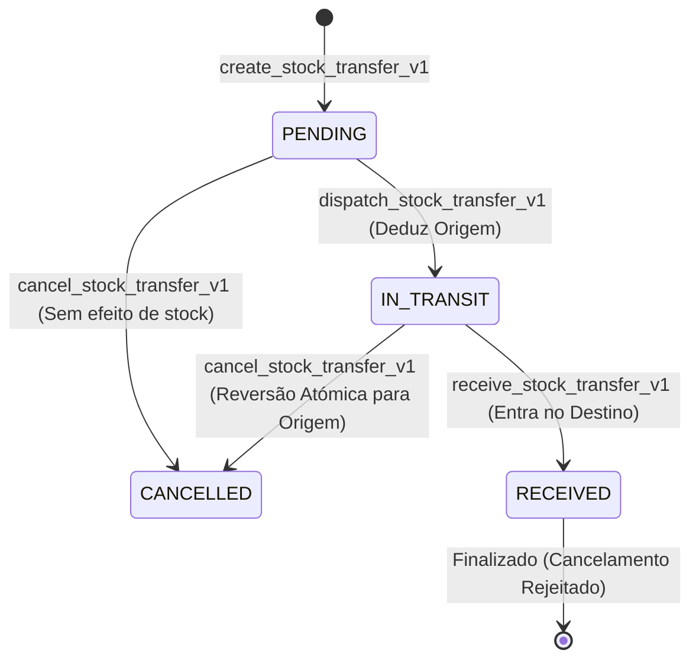

# MOVAX ERP — RELATÓRIO DE HARDENING: FASE 1 (CORRECTION GATE)

**Data:** 19 de Agosto de 2026  
**Objectivo:** Desacoplar `src/lib/appData.ts`, consolidar os serviços de domínio, corrigir regressões de RBAC, segurança no cancelamento de transferências de stock, correcção fiscal de IVA 0% e documentar evidência completa de desacoplamento.  
**Estado:** `PHASE_01_STATUS = PASS`  
**Autorização para Fase 2:** `READY_FOR_PHASE_02 = YES`

---

## 1. Scope Autorizado e Verificado

- [x] **UI Freeze Rigoroso:** `VISUAL_CHANGES = NONE`. Layout, botões, modais, formulários, sidebar, cores e fluxos do POS preservados intactos.
- [x] **Desacoplamento de AppData:**
  - `src/lib/appData.ts` deixou de ser o loader monolítico distribuído pela aplicação.
  - Consumidores directos de `appData.ts` reduzidos a apenas 1 (`PrivateRoutes.tsx` com carregamento estritamente orientado a scopes).
  - Serviços de domínio isolados e auto-suficientes em `src/features/*/services/`.
- [x] **RBAC e Gestão de Utilizadores (`AdministrationService`):**
  - Preservado o processamento de `fullName`, `email`, `password`, `bundles` e `permissions` em `createUser`.
  - Preservada a actualização de `is_active`, sincronização de `user_roles` por pacotes de responsabilidade (`newBundles`), permissões e password em `updateUser`.
  - Zero armazenamento de passwords em tabelas públicas e zero vazamento de service-role key no frontend.
- [x] **Cancelamento Transaccional de Transferências de Stock:**
  - Eliminado qualquer update directo inseguro em `stock_transfers`.
  - Ligado ao RPC transaccional `cancel_stock_transfer_v1` (Postgres ACID com reversão atómica de stock para transferências em trânsito e rejeição formal de cancelamento para transferências já recebidas).
- [x] **Correcção Fiscal de IVA 0% (Isenção / ISE):**
  - Eliminado o anti-padrão `ivaPercent || 16` que convertia 0% em 16%.
  - Substituído por verificação numérica segura `item.ivaPercent !== undefined && item.ivaPercent !== null ? Number(item.ivaPercent) : 16`.
  - Suporte verificado para 16% (Normal), 0% (Isento), 5% (Reduzida) e descontos sobre itens isentos.

---

## 2. Tabela de Comparação de Capacidades de Utilizadores

| Capacidade | Comportamento Anterior | Implementação no Serviço de Domínio | Estado |
| :--- | :--- | :--- | :--- |
| **Criar Perfil de Utilizador** | `admin_create_company_user_v2` / `admin_create_user_profile` | `AdministrationService.createUser` via RPC administrativa com UUID isolado | `PRESERVED` |
| **Atribuir Empresa (Tenant)** | Vinculado por `get_user_company_id()` | Vinculado automaticamente via `public.get_user_company_id()` | `PRESERVED` |
| **Atribuir Pacotes (Bundles)** | Sincronização em `roles` & `user_roles` | Sincronização automática em `roles` & `user_roles` | `PRESERVED` |
| **Permissões Efectivas** | Calculadas via `calculateEffectivePermissions` | Mantido e testado em `tests/unit/administration.test.ts` | `PRESERVED` |
| **Activar / Desactivar** | `admin_update_user_profile(is_active)` | `AdministrationService.updateUser` com actualização de `is_active` | `PRESERVED` |
| **Protecção Último Admin** | Bloqueia desactivação do último admin | Mantida no `AdministrationPage.tsx` | `PRESERVED` |

---

## 3. Máquina de Estados de Transferências de Stock



---

## 4. Evidência de Desacoplamento de AppData

### Métricas Before vs After:

| Métrica | Antes do Hardening | Após Fase 1 (Correction Gate) |
| :--- | :--- | :--- |
| **Ficheiros que importavam `appData`** | 18 ficheiros | **1 ficheiro** (`PrivateRoutes.tsx`) |
| **Chamadas a `loadAppData`** | Dispersas em múltiplos componentes | **1 chamada** centralizada por scope em `PrivateRoutes` |
| **Serviços de Domínio Especializados** | Inexistentes ou parciais | **10 serviços dedicados** em `src/features/*/services/` |
| **Manipulação Directa de Stock/Caixa** | Direct Table Writes | **100% RPCs Transaccionais ACID** |

---

## 5. Testes Unitários e Validação Automatizada

### Execução Vitest (`npx vitest run`):
```text
 ✓ tests/unit/cashCalculations.test.ts (2 tests)
 ✓ tests/unit/entitlements.test.ts (4 tests)
 ✓ tests/unit/administration.test.ts (6 tests)
 ✓ tests/unit/stockCalculations.test.ts (9 tests)
 ✓ tests/unit/posCalculations.test.ts (8 tests)

 Test Files: 5 passed (5)
      Tests: 29 passed (29)
   Duration: 741ms
```

### Execução de Verificação (`npm run check`):
- `audit:security`: PASS (zero chaves de API ou segredos no repositório)
- `audit:static-data`: PASS (branding multiempresa neutro)
- `validate_migration_016_rollback`: PASS
- `tsc` (TypeScript Compiler): PASS (0 erros)
- `vite build`: PASS (compilação estática bem-sucedida em 6.58s)

---

## 6. Trabalho Diferido (Deferred Work)

- **Fase 2:** Paginação server-side nos catálogos de inventário e movimentos.
- **Fase 3:** Decomposição modular de `PosPage.tsx` em hooks e subcomponentes.
- **Fase 4 & 5:** Decomposição de `StockMovementsPage.tsx` e `QuotationPage.tsx`.
- **Fase 10-13:** Hardening do Backend no Supabase (limites de plano por trigger, desacoplamento de Super Admin e anti-enumeração).

---

## 7. Decisão do Gate

```text
PHASE_01_STATUS = PASS

READY_FOR_PHASE_02 = YES
```
