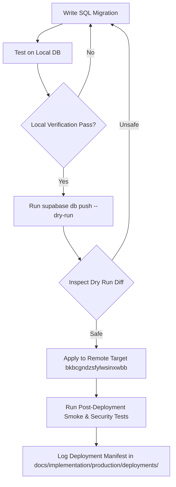

# Production Deployment Strategy & Safety Controls

> **Target Project:** `bkbcgndzsfylwsinxwbb.supabase.co`  
> **Mode:** Production Pre-Live  

---

## 1. Operating Principles

1. **Target:** Production project `bkbcgndzsfylwsinxwbb` is the target environment from Day 1.
2. **Version Control:** 100% of database changes must exist as timestamped, ordered migration files in `supabase/migrations/`.
3. **Local Validation:** Every migration file must be validated locally (`supabase db reset` on local Docker stack) before pushing to production.
4. **Dry Run Pre-flight:** Production deployment requires running `supabase db push --dry-run` to inspect SQL diffs prior to execution.
5. **No Production Resets:** `supabase db reset --linked` is **STRICTLY BANNED**.
6. **Pre-Live Isolation:** System mode defaults to `MIGRATION`. Public access is blocked via server-side guards until Phase 15 activation.

---

## 2. System Activation Modes

```text
  [ MIGRATION ]  --->  [ PILOT ]  --->  [ LIVE ]
        ^                                   |
        +------------- [ MAINTENANCE ] <----+
```

| System Mode | Description | Allowed Users | Operations Allowed |
|-------------|-------------|---------------|-------------------|
| `MIGRATION` (Default) | System initialization & legacy data import | Admins & Migration RPCs | Schema application, raw legacy load, transformation, reconciliation |
| `PILOT` | Controlled pre-launch testing with select operators | Admins + Designated Pilot Users | Real-time testing, audited transactions |
| `LIVE` | Operational status for Casa de Pneus, Lda. | All authenticated staff per RBAC | Standard commercial operations |
| `MAINTENANCE` | System maintenance or emergency freeze | System Admins only | Read-only access, system maintenance |

---

## 3. Production Deployment Pipeline



---

## 4. Environment Credentials Security

- Service role keys and access tokens must reside exclusively in local `.env` or CI/CD secret vaults.
- No private key or database password may ever be committed to Git repositories or exposed in browser bundles.
