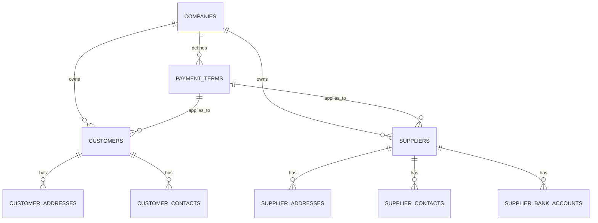

# Customer & Supplier Master Data Schema Architecture

> **Target Project:** `bkbcgndzsfylwsinxwbb.supabase.co`  
> **Work Package:** PROD-WP07  
> **Status:** DEPLOYED TO PRODUCTION  

---

## 1. Schema Overview

PROD-WP07 establishes the customer and supplier entity models, payment conditions, multi-address support, multi-contact support, supplier banking credentials, and protected opening balance RPCs.

---

## 2. Table Specifications

### 2.1 `public.payment_terms`
- Stores commercial credit conditions (`DINHEIRO`, `7_DIAS`, `15_DIAS`, `30_DIAS`, `60_DIAS`).
- Isolated per company via `company_id`.

### 2.2 `public.customers` & `public.suppliers`
- Master entity records containing `customer_number` / `supplier_number`, `name`, `tax_number` (NUIT), `credit_limit`, `opening_balance`, `current_balance`.
- Unique constraint on `(company_id, customer_number)` and `(company_id, supplier_number)`.
- `tax_number` is NOT globally unique, supporting corporate groups with shared NUITs.

### 2.3 `public.customer_addresses` & `public.supplier_addresses`
- Supports address types: `BILLING`, `DELIVERY`, `GENERAL`.
- `is_primary` flag for default selection.

### 2.4 `public.customer_contacts` & `public.supplier_contacts`
- Individual contact persons with position, telephone, mobile phone, and email.

### 2.5 `public.supplier_bank_accounts`
- Confidential supplier banking details (`bank_name`, `account_number`, `iban`, `swift_code`).
- Protected via dedicated RLS policy `supplier_bank_accounts_select` requiring `suppliers.view_bank_details` permission.
- Masked from general Sales, Stock, and Read-Only roles.

---

## 3. Protected Balance Functions (`private` Schema)

- `private.initialise_customer_opening_balance(p_company_id, p_customer_id, p_opening_balance)`
- `private.initialise_supplier_opening_balance(p_company_id, p_supplier_id, p_opening_balance)`

*Balances are system-controlled fields and cannot be modified directly via public client REST updates.*
