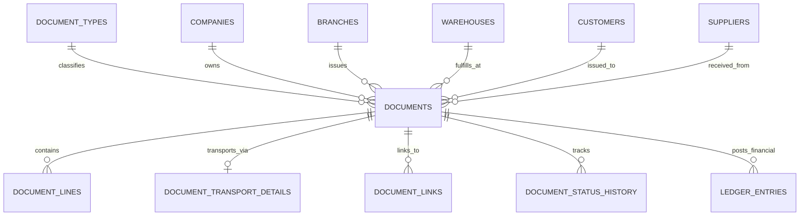

# Commercial Document Schema Architecture

> **Target Project:** `bkbcgndzsfylwsinxwbb.supabase.co`  
> **Work Package:** PROD-WP08  
> **Status:** DEPLOYED TO PRODUCTION  

---

## 1. Entity Architecture

PROD-WP08 introduces full commercial document processing capabilities across sales and procurement modules.

---

## 2. Table Specifications

### 2.1 `public.document_types`
- Holds 10 core commercial document types (`CUSTOMER_DELIVERY_NOTE`, `CUSTOMER_INVOICE`, `CASH_SALE`, `CUSTOMER_CREDIT_NOTE`, `CUSTOMER_DEBIT_NOTE`, `SUPPLIER_DELIVERY_NOTE`, `SUPPLIER_INVOICE`, `SUPPLIER_CREDIT_ADVICE`, `SUPPLIER_DEBIT_ADVICE`, `SUPPLIER_RETURN`).

### 2.2 `public.documents` & `public.document_lines`
- Document header and line items with immutable snapshots taken upon confirmation.
- Includes subtotal, discount, net, tax, grand total, amount paid, and outstanding amount.
- Duplicate supplier invoice protection via partial unique index `uq_active_supplier_invoice_number`.

### 2.3 `public.ledger_entries`
- Document-origin financial current-account ledger keeping customer and supplier accounts accurate.
