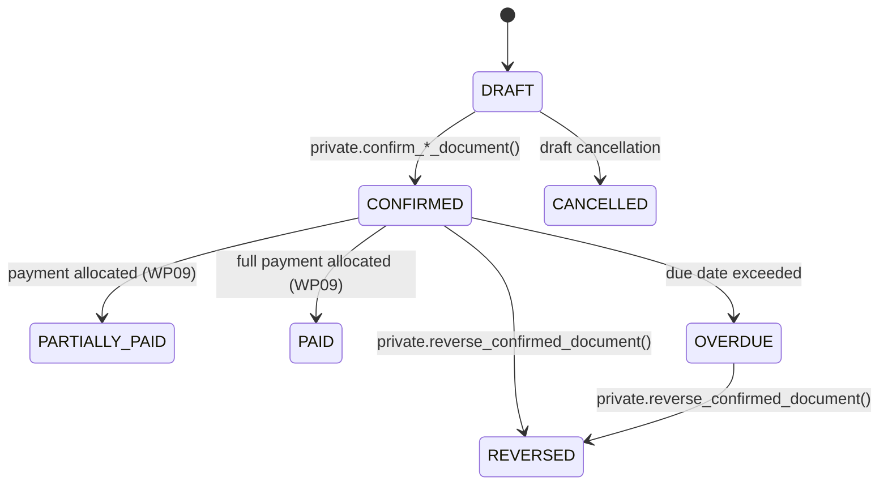

# Document Numbering & Status State Machine

> **Target Project:** `bkbcgndzsfylwsinxwbb.supabase.co`  

---

## 1. Document Numbering Sequence

- Sequence numbers are assigned **atomically at confirmation time** via `private.next_document_number(...)`.
- Format: `<TYPE_CODE> <SERIES>/<NUMBER_LPAD_6>` (e.g. `CUSTOMER_INVOICE A/000001`).
- Drafts have `document_number = NULL` and `display_number = NULL` to prevent gap generation on draft deletions.

---

## 2. Status Transition State Machine

