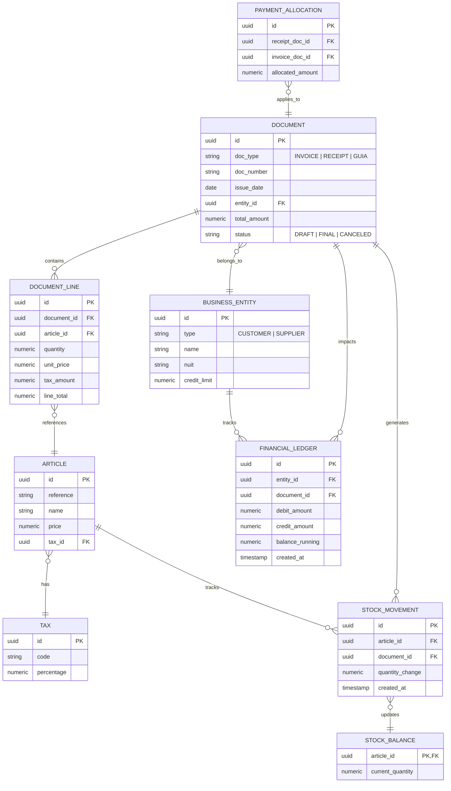

# Domain Model: Casa de Pneus System

## 1. Bounded Contexts
1.  **Catalogue (Master Data):** Articles, Categories, Taxes, Units of Measure.
2.  **Inventory (Stock):** Warehouses, Stock Movements, Current Quantities.
3.  **Commercial (Sales):** Customer Orders, Invoices, Delivery Notes, Credit/Debit Notes.
4.  **Procurement (Purchases):** Supplier Invoices, Supplier Delivery Notes.
5.  **Accounting & Payments:** Current Accounts, Receipts, Payments, Payment Allocations.
6.  **Identity & Admin:** Users, Profiles, Permissions, System Settings, Audit Logs.

## 2. Value Objects
*   `Money`: Encapsulates a monetary value. (e.g., `amount: NUMERIC(15,2)`, `currency: "MZN"`).
*   `DocumentNumber`: A formatted, sequential string representing a legal document (e.g., `"FT 2023/001"`).
*   `TaxNumber (NUIT)`: Validated string for Mozambican tax identification.
*   `Address`: Street, City, Province, Postal Code.

## 3. Key Aggregates and Roots
*   **Article (Root):** Maintains the definition, pricing, and tax classification of a product.
*   **Entity (Root):** Represents a Customer or Supplier. Maintains base information and credit limits.
*   **Document (Root):** Represents any commercial transaction (Invoice, Receipt, Delivery Note). Composed of Document Lines.
*   **Stock Ledger (Root):** The immutable log of all inventory changes.
*   **Current Account Ledger (Root):** The immutable log of financial obligations and settlements.

## 4. Entity Relationship Diagram (Mermaid)

## 5. Domain Invariants
*   **Document Immutability:** Once a `Document` is transitioned to the `FINAL` state, neither the document header nor its lines can be modified or deleted. Any corrections require a Credit Note or Reversal Document.
*   **Sequential Numbering:** Documents of fiscal relevance (Invoices, Receipts) must have continuous, gapless sequence numbers per year/series.
*   **Financial Balance Constraint:** A `PAYMENT_ALLOCATION` cannot allocate more funds to an `INVOICE` than the `INVOICE`'s remaining open balance.
*   **Double Entry Principle (Simplified):** For Current Accounts, an Invoice creates a Debit (for Customers), and a Receipt creates a Credit. The overall Balance is the sum of Debits minus sum of Credits.

## 6. Domain Events
*   `DocumentFinalizedEvent`: Triggered when an invoice or receipt is confirmed.
*   `StockAdjustedEvent`: Triggered upon confirmation of a Guia or manual adjustment. Leads to updating the `STOCK_BALANCE`.
*   `PaymentReceivedEvent`: Triggered when a receipt is finalized, leading to updating the `FINANCIAL_LEDGER`.

## 7. Ubiquitous Language Glossary
*   **Artigo** -> Article / Product / Service
*   **Cliente** -> Customer
*   **Fornecedor** -> Supplier
*   **Guia de Remessa** -> Delivery Note (moves stock, no financial impact)
*   **Factura** -> Invoice (financial impact, may move stock)
*   **Venda a Dinheiro** -> Cash Sale (Invoice + Receipt combined)
*   **Nota de Crédito** -> Credit Note (reduces customer debt / supplier debt)
*   **Nota de Débito** -> Debit Note (increases debt)
*   **Recibo** -> Receipt (proof of payment from customer)
*   **Pagamento** -> Payment (outgoing payment to supplier)
*   **Conta Corrente** -> Current Account / Ledger
*   **Entrada de Stock** -> Stock Entry
*   **Saída de Stock** -> Stock Exit
