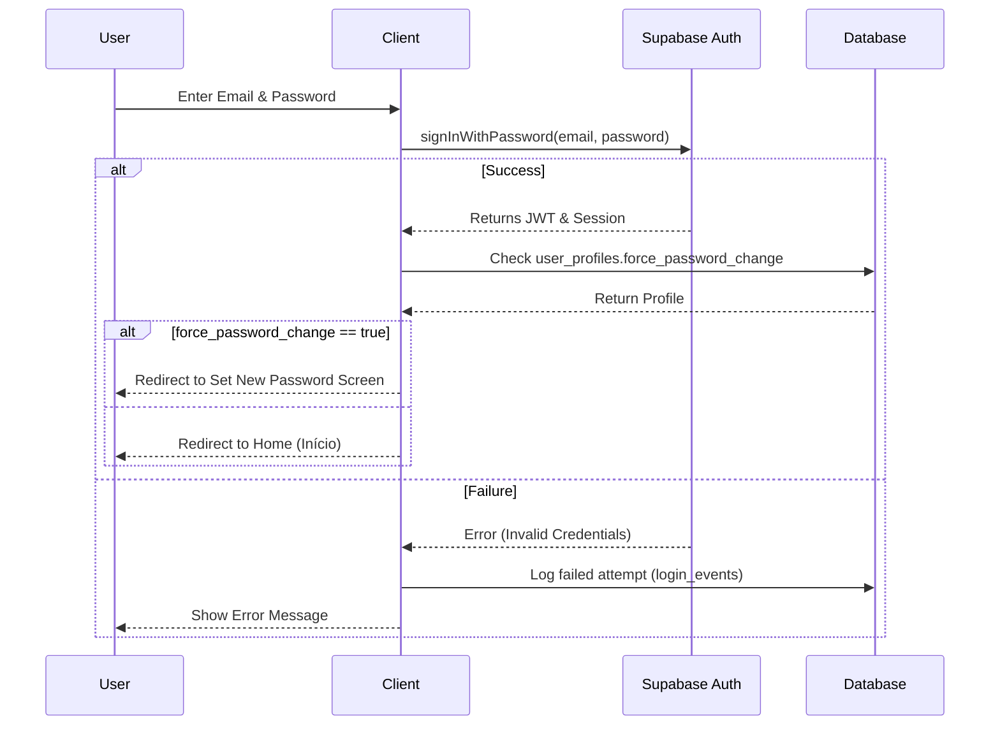
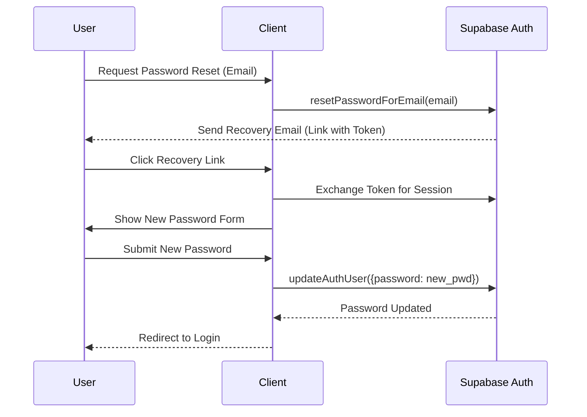
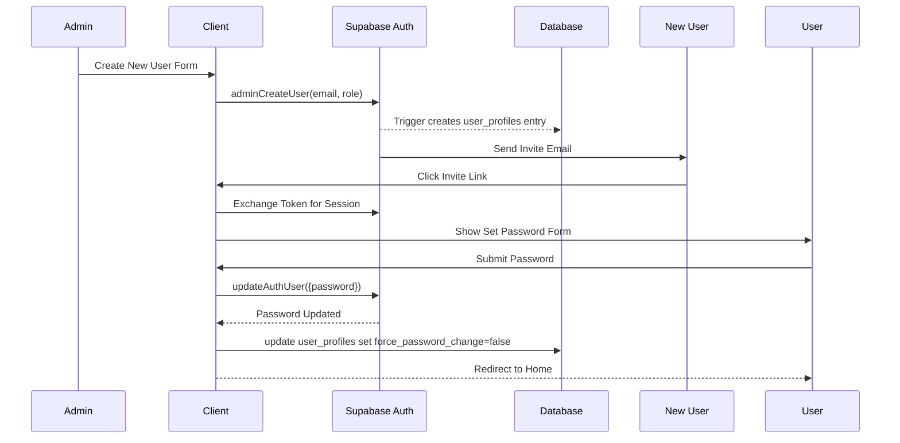

# 07 Authentication Design

## Overview
The authentication system for Casa de Pneus is built on top of **Supabase Auth**. This document details the login flows, password policies, session management, and the relationship between Supabase's internal auth tables and the application's user profiles.

## Login Flow
- **Method**: Email/Username + Password.
- **Endpoint**: Utilizes Supabase `signInWithPassword`.
- **First Login**: Users are assigned temporary passwords upon creation and are forced to change their password on the first login via a `force_password_change` flag in `public.user_profiles`.

## Password Requirements
- Minimum length: 8 characters.
- Must contain at least one uppercase letter, one lowercase letter, one number, and one special character.
- Checked during the password reset and first login flows.

## Session Management
- **Expiry**: JWT tokens expire after 8 hours to align with standard shift durations.
- **Revocation & Rotation**: Refresh tokens are rotated automatically. Sessions can be revoked manually by administrators.
- **Admin Session Termination**: Administrators can forcefully terminate any user's active session.

## Security Controls
- **Rate Limiting**: After 5 failed login attempts, the account is temporarily locked for 15 minutes.
- **Failed Login Tracking**: All failed attempts are logged in a `login_events` table (timestamp, IP, username).
- **Disabled User Handling**: Attempting to login with a disabled account immediately rejects the request. Supabase auth user can be marked disabled, or the `is_active` flag in `user_profiles` is checked.
- **Last Login Recording**: Trigger updates `last_login_at` in `user_profiles`.
- **MFA Preparation**: System is designed to support TOTP (Time-based One-Time Password) natively via Supabase MFA APIs for high-privilege roles.
- **Device & Login History**: User's device info and IPs are logged upon successful login for audit purposes.

## Relationship Between `auth.users` and `public.user_profiles`
Supabase manages authentication credentials in the `auth.users` schema. The Casa de Pneus system stores application-specific details (name, active status, preferred language, theme) in `public.user_profiles`.
- A database trigger automatically creates a corresponding row in `public.user_profiles` when a new user signs up or is created by an admin.

## Administration
- **Server-Side Control**: Clients cannot set their own roles. Role assignment is exclusively handled server-side by administrators using Edge Functions or restricted RPC calls.
- **Invitation Flow**: 
  1. Admin creates a user and sends an invitation link.
  2. The user receives an email with a secure, single-use token.
  3. The user clicks the link, sets their permanent password, and completes the profile.
- **Recovery Flow**: Password reset links are dispatched via email and expire after a short duration (e.g., 1 hour).

## Mermaid Diagrams

### Login Flow

### Password Reset Flow

### Invitation Flow

