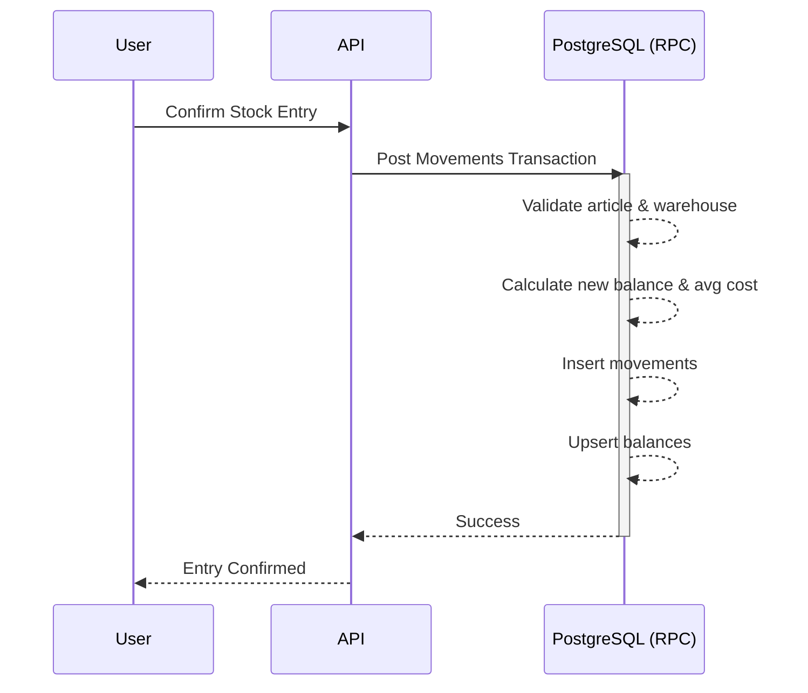

# 11 Stock Accounting Engine

## Overview
This document details the stock accounting engine, including movement types, weighted average cost calculation, and the posting procedure.

## Movement Types
- `opening_stock`
- `direct_entry`
- `direct_exit`
- `purchase_entry`
- `sales_exit`
- `customer_return`
- `supplier_return`
- `stock_correction`
- `stock_transfer_out`
- `stock_transfer_in`
- `reversal`
- `inventory_adjustment`

## Stock Posting Procedure
Executed via a single PostgreSQL transaction/RPC to guarantee integrity:
1. Validate article exists and is active.
2. Validate warehouse access.
3. Check negative stock policy (allow/deny per company).
4. Calculate new balance.
5. Insert `stock_movement`.
6. Update `inventory_balances` (upsert).
7. Update product `avg_cost` if entry.

## Diagrams

