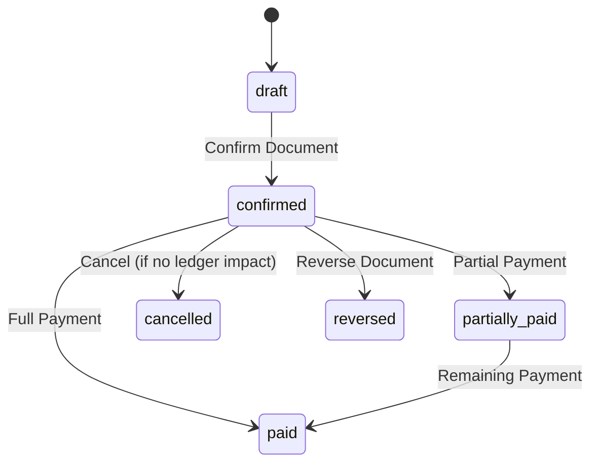

# 12 Sales and Purchase Workflows

## Sales Documents State Machine
States: `draft`, `confirmed`, `partially_paid`, `paid`, `cancelled`, `reversed`

## Document Types
- **Delivery Note (Guia de Remessa):** Creates stock exit, no financial effect.
- **Invoice (Factura):** Creates stock exit, creates receivable ledger entry.
- **Cash Sale (Venda a Dinheiro):** Invoice + immediate full payment.
- **Credit Note (Nota de Crédito):** Reverses invoice lines, stock return, credit ledger.
- **Debit Note (Nota de Débito):** Additional charge, debit ledger.

## Supplier Documents
- **Supplier Delivery Note:** Records received goods, stock entry.
- **Supplier Invoice:** Links to delivery notes, creates payable ledger.
- **Supplier Debit Advice:** Additional charge.
- **Supplier Credit Advice:** Credit from supplier.
- **Supplier Return:** Stock exit, credit ledger.

## Document Confirmation Process
1. Validate fields.
2. Validate line items.
3. Generate document number from sequence (gap-free).
4. Create stock movements.
5. Create ledger entries.
6. Update document status.
