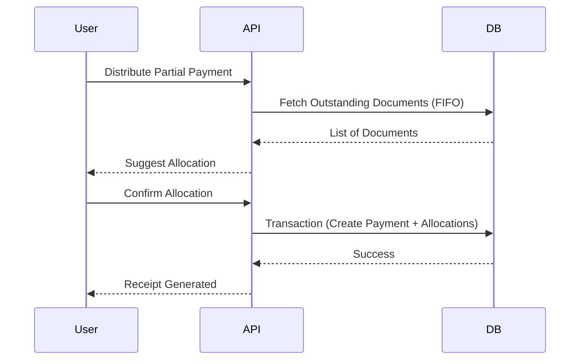

# 13 Payments and Current Accounts

## Overview
Manages cash flow and customer/supplier ledger accounts. Payments can be split across multiple documents.

## Payment Types & Methods
- **Customer Receipt (Recebimento):** Money IN.
- **Supplier Payment (Pagamento):** Money OUT.
- **Methods:** Numerário, Transferência Bancária, Cartão, M-Pesa, Cheque, Mixed.

## Payment Allocation
- One payment → one document or multiple documents.
- Multiple payments → one document.
- Partial payments are supported.
- Oldest first (FIFO) auto-allocation on Stitch screen `3c2a4712`.

