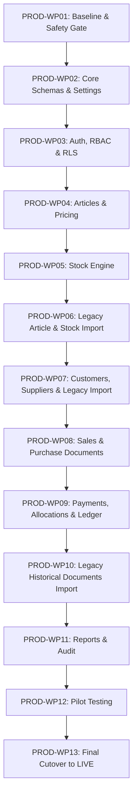

# Revised Implementation Roadmap (13 Production Work Packages)

> **Fixed Target Project:** `bkbcgndzsfylwsinxwbb.supabase.co`  
> **Key Revisions:** Removed empty staging requirement; target is production in pre-live mode (`MIGRATION` → `PILOT` → `LIVE`); domain-interleaved migration; continuous security & RLS testing in every package.

---

## Production Work Package Overview

### Detailed Summary

1. **PROD-WP01: Production Baseline & Safety Foundation** (Mode: `MIGRATION`)
   - Audit target `bkbcgndzsfylwsinxwbb`, verify clean database, establish backup protocols & evidence structures.
2. **PROD-WP02: Core Schema & Company Configuration** (Mode: `MIGRATION`)
   - Schemas: `public`, `private`, `migration`, `audit`. Core tables: `companies`, `branches`, `warehouses`, `fiscal_periods`, `company_settings`.
3. **PROD-WP03: Authentication, RBAC & RLS Foundation** (Mode: `MIGRATION`)
   - Supabase Auth profiles, 8 RBAC roles, ~70 permissions, RLS policies on all tables, helper security functions.
4. **PROD-WP04: Articles & Reference Data** (Mode: `MIGRATION`)
   - Product catalogue (`products`, `product_families`, `product_categories`, `brands`, `units_of_measure`, `tax_codes` Moz IVA 16%, `price_history`).
5. **PROD-WP05: Stock Engine & Balance Posting** (Mode: `MIGRATION`)
   - Inventory balances, stock movements, reasons, inventory counts, transfers, transactional RPCs.
6. **PROD-WP06: Legacy Article & Opening Stock Migration** (Mode: `MIGRATION`)
   - Staging import in `migration.products_raw` and `migration.stock_movements_raw`, transformation, reconciliation.
7. **PROD-WP07: Customers, Suppliers & Legacy Contact Migration** (Mode: `MIGRATION`)
   - Customer and supplier entities, addresses, contacts, bank accounts; import legacy XT-POS contacts.
8. **PROD-WP08: Commercial Documents (Sales & Purchases)** (Mode: `MIGRATION`)
   - Document types, documents, lines, status history, links, gap-free sequences (`document_sequences`).
9. **PROD-WP09: Payments, Allocations & Current Accounts** (Mode: `MIGRATION`)
   - Payment methods, payments, method entries, allocations, reversals, ledger accounts & entries.
10. **PROD-WP10: Historical Document & Payment Migration** (Mode: `MIGRATION`)
    - Import legacy XT-POS invoices, credit notes, receipts, balances; transform, reconcile.
11. **PROD-WP11: Reports, Printing & Operational Monitoring** (Mode: `MIGRATION`)
    - Report views, daily cash report, stock valuation, margin analysis with cost-price masking, PDF export.
12. **PROD-WP12: Pilot Deployment & Acceptance Testing** (Mode: `PILOT`)
    - Onboard pilot staff, run pre-live testing, verify multi-user permission isolation & audit logs.
13. **PROD-WP13: Final Delta Cutover & System Activation** (Mode: `LIVE`)
    - Freeze XT-POS, run final delta import, 100% reconciliation pass, activate mode `LIVE`.
