# Entity-Relationship Diagram — Casa de Pneus, Lda.

> This document provides a visual representation of the complete database schema across all domains.

## Full System ER Diagram

```mermaid
erDiagram
    %% ═══════════════════════════════════════════
    %% CORE
    %% ═══════════════════════════════════════════
    companies ||--o{ branches : "has"
    companies ||--o{ company_settings : "configures"
    companies ||--o{ fiscal_periods : "defines"
    companies ||--o{ document_sequences : "owns"
    branches ||--o{ warehouses : "contains"

    %% ═══════════════════════════════════════════
    %% IDENTITY
    %% ═══════════════════════════════════════════
    companies ||--o{ user_profiles : "employs"
    companies ||--o{ roles : "defines"
    roles ||--o{ role_permissions : "grants"
    permissions ||--o{ role_permissions : "assigned_via"
    user_profiles ||--o{ user_roles : "holds"
    roles ||--o{ user_roles : "assigned_to"
    user_profiles ||--o{ branch_access : "accesses"
    branches ||--o{ branch_access : "grants_to"
    user_profiles ||--o{ warehouse_access : "accesses"
    warehouses ||--o{ warehouse_access : "grants_to"
    user_profiles ||--o{ login_events : "generates"

    %% ═══════════════════════════════════════════
    %% CATALOGUE
    %% ═══════════════════════════════════════════
    companies ||--o{ products : "sells"
    companies ||--o{ product_families : "categorises"
    companies ||--o{ brands : "stocks"
    companies ||--o{ units_of_measure : "uses"
    companies ||--o{ tax_codes : "applies"
    product_families ||--o{ product_categories : "contains"
    product_families ||--o{ products : "groups"
    product_categories ||--o{ products : "classifies"
    brands ||--o{ products : "manufactures"
    units_of_measure ||--o{ products : "measures"
    tax_codes ||--o{ products : "taxes"
    products ||--o{ price_history : "tracks_changes"

    %% ═══════════════════════════════════════════
    %% STOCK / INVENTORY
    %% ═══════════════════════════════════════════
    products ||--o{ inventory_balances : "stocked_at"
    warehouses ||--o{ inventory_balances : "holds"
    products ||--o{ stock_movements : "moved"
    warehouses ||--o{ stock_movements : "in_out_of"
    stock_movement_reasons ||--o{ stock_movements : "justifies"
    warehouses ||--o{ inventory_counts : "counted_in"
    inventory_counts ||--o{ inventory_count_lines : "lines"
    products ||--o{ inventory_count_lines : "counted"
    warehouses ||--o{ stock_transfers : "from"
    warehouses ||--o{ stock_transfers : "to"
    stock_transfers ||--o{ stock_transfer_lines : "lines"
    products ||--o{ stock_transfer_lines : "transferred"

    %% ═══════════════════════════════════════════
    %% CUSTOMERS
    %% ═══════════════════════════════════════════
    companies ||--o{ customers : "serves"
    customers ||--o{ customer_addresses : "located_at"
    customers ||--o{ customer_contacts : "contacted_via"

    %% ═══════════════════════════════════════════
    %% SUPPLIERS
    %% ═══════════════════════════════════════════
    companies ||--o{ suppliers : "buys_from"
    suppliers ||--o{ supplier_addresses : "located_at"
    suppliers ||--o{ supplier_contacts : "contacted_via"
    suppliers ||--o{ supplier_bank_accounts : "paid_to"

    %% ═══════════════════════════════════════════
    %% COMMERCIAL DOCUMENTS
    %% ═══════════════════════════════════════════
    companies ||--o{ document_types : "defines"
    companies ||--o{ documents : "issues"
    document_types ||--o{ documents : "typed_as"
    customers ||--o{ documents : "billed_to"
    suppliers ||--o{ documents : "received_from"
    documents ||--o{ document_lines : "contains"
    products ||--o{ document_lines : "sold_bought"
    documents ||--o{ document_status_history : "status_tracked"
    documents ||--o{ document_links : "source"
    documents ||--o{ document_links : "target"

    %% ═══════════════════════════════════════════
    %% PAYMENTS
    %% ═══════════════════════════════════════════
    companies ||--o{ payment_methods : "accepts"
    companies ||--o{ payments : "processes"
    customers ||--o{ payments : "pays"
    suppliers ||--o{ payments : "paid_by"
    payments ||--o{ payment_method_entries : "split_into"
    payment_methods ||--o{ payment_method_entries : "used_in"
    payments ||--o{ payment_allocations : "allocated_to"
    documents ||--o{ payment_allocations : "settled_by"
    payments ||--o{ payment_reversals : "reversed_via"

    %% ═══════════════════════════════════════════
    %% LEDGER
    %% ═══════════════════════════════════════════
    companies ||--o{ ledger_accounts : "maintains"
    ledger_accounts ||--o{ ledger_entries : "posted_to"
    documents ||--o{ ledger_entries : "sourced_from"
    payments ||--o{ ledger_entries : "sourced_from"
    ledger_entries ||--o{ ledger_entry_links : "linked"

    %% ═══════════════════════════════════════════
    %% AUDIT / ADMIN
    %% ═══════════════════════════════════════════
    companies ||--o{ audit_logs : "audits"
    user_profiles ||--o{ audit_logs : "performed_by"
    documents ||--o{ print_logs : "printed"
    user_profiles ||--o{ print_logs : "printed_by"

    %% ═══════════════════════════════════════════
    %% MIGRATION
    %% ═══════════════════════════════════════════
    companies ||--o{ migration_batches : "imports"
    migration_batches ||--o{ migration_sources : "loaded_from"
    migration_batches ||--o{ migration_table_maps : "maps"
    migration_table_maps ||--o{ migration_field_maps : "field_maps"
    migration_batches ||--o{ migration_records : "tracks"
    migration_batches ||--o{ migration_errors : "reports"
    migration_batches ||--o{ migration_reconciliation_results : "verifies"
```

## Domain Grouping Summary

```mermaid
graph TB
    subgraph "Core Infrastructure"
        C[companies] --> B[branches]
        B --> W[warehouses]
        C --> FP[fiscal_periods]
        C --> DS[document_sequences]
        C --> CS[company_settings]
    end

    subgraph "Identity & Access"
        C --> UP[user_profiles]
        C --> R[roles]
        R --> RP[role_permissions]
        UP --> UR[user_roles]
        UP --> BA[branch_access]
        UP --> WA[warehouse_access]
    end

    subgraph "Product Catalogue"
        C --> P[products]
        C --> PF[product_families]
        PF --> PC[product_categories]
        C --> BR[brands]
        C --> UOM[units_of_measure]
        C --> TC[tax_codes]
        P --> PH[price_history]
    end

    subgraph "Inventory Engine"
        P --> IB[inventory_balances]
        W --> IB
        P --> SM[stock_movements]
        W --> IC[inventory_counts]
        W --> ST[stock_transfers]
    end

    subgraph "Commercial Documents"
        C --> DT[document_types]
        C --> D[documents]
        D --> DL[document_lines]
        D --> DSH[document_status_history]
        D --> DLK[document_links]
    end

    subgraph "Payments & Ledger"
        C --> PM[payment_methods]
        C --> PAY[payments]
        PAY --> PME[payment_method_entries]
        PAY --> PA[payment_allocations]
        C --> LA[ledger_accounts]
        LA --> LE[ledger_entries]
    end

    subgraph "Migration"
        C --> MB[migration_batches]
        MB --> MS[migration_sources]
        MB --> MR[migration_records]
        MB --> ME[migration_errors]
        MB --> MRR[migration_reconciliation_results]
    end

    style C fill:#003366,color:#fff
    style P fill:#006e25,color:#fff
    style D fill:#003366,color:#fff
    style PAY fill:#006e25,color:#fff
    style SM fill:#ba1a1a,color:#fff
```

## Table Count Summary

| Domain | Tables | Key Entity |
|--------|--------|-----------|
| Core | 6 | `companies` |
| Identity | 8 | `user_profiles` |
| Catalogue | 7 | `products` |
| Stock | 7 | `stock_movements` |
| Customers | 3 | `customers` |
| Suppliers | 4 | `suppliers` |
| Documents | 5 | `documents` |
| Payments | 5 | `payments` |
| Ledger | 3 | `ledger_entries` |
| Administration | 5 | `audit_logs` |
| Migration | 7 | `migration_batches` |
| **Total** | **60** | — |
